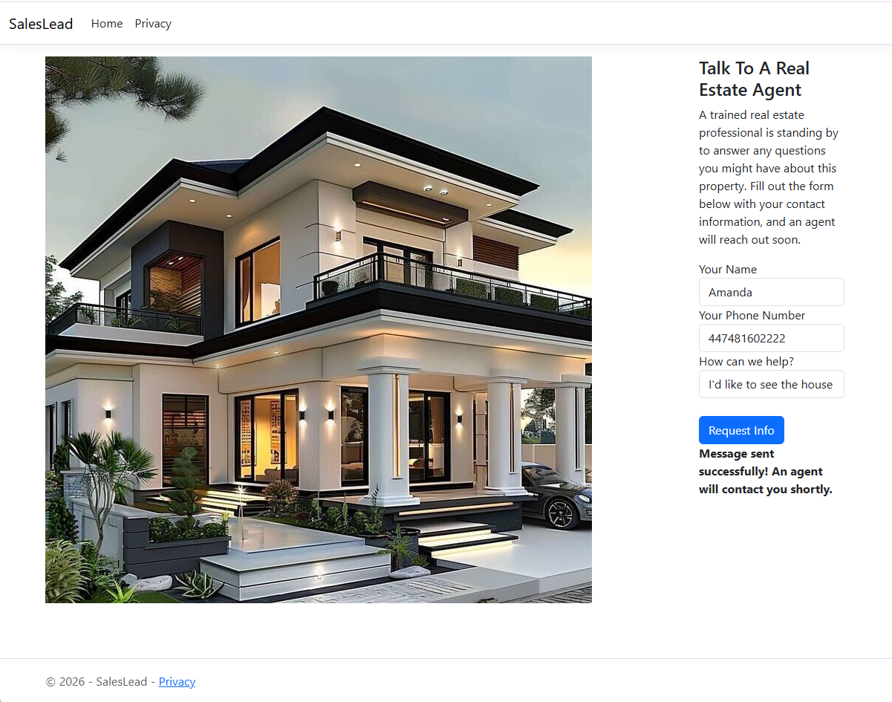

# Vonage ASP.NET MVC Application and .NET 10 Sample

This repository shows you how to use the Vonage Messages API with a real-world application using an ASP.NET MVC Application and .NET 10. For a full walkthrough, see the accompanying [blog post](https://developer.vonage.com/en/blog/build-an-asp-net-mvc-app-to-send-sms-messages).

* [Requirements](#requirements)
* [Installation and Usage](#installation-and-usage)
  * [Vonage Application Credentials](#vonage-application-credentials)
  * [Setting the Phone Numbers](#setting-the-phone-numbers)
  * [Running the Application](#running-the-application)
* [Contributing](#contributing)
* [License](#license)

*Figure 1: The completed web application that we are building*

## Requirements

This application requires that you have the following installed locally:

* [Visual Studio 2026 Community Edition or higher](https://visualstudio.microsoft.com/) with the **ASP.NET and web development** workload
* [.NET 10 SDK](https://dotnet.microsoft.com/download/dotnet/10.0) (included with Visual Studio 2026)
* [Vonage .NET SDK 8.35.0 or higher](https://www.nuget.org/packages/Vonage/) (restored automatically via NuGet)

To test the application, you will also need:

* A Vonage account. You can create one for free or manage your account details at the [Vonage Dashboard](https://dashboard.vonage.com).
* A Vonage virtual number that can send SMS.
* A mobile phone that can receive SMS.

> **Note:** If your account is still on trial credit, you can only send SMS to numbers you've verified in the Dashboard. If you're sending to US numbers, you may also need to complete 10DLC registration.

## Installation and Usage

You can run this application by first cloning this repository locally and opening `SalesLead.slnx` in Visual Studio, or by using the built-in source control tooling inside Visual Studio.

Once you have a local copy, change into the directory of the application and set up the credentials for your Vonage account.

### Vonage Application Credentials

This sample sends SMS via the [Vonage Messages API](https://developer.vonage.com/en/messages/overview), which authenticates with a Vonage Application ID and private key:

1. In the [Vonage Dashboard](https://dashboard.vonage.com/applications), create a new application, generate a public/private key pair, and save the downloaded `private.key` file.
2. Enable the **Messages** capability on the application and link one of your Vonage virtual numbers to it.
3. Copy the `private.key` file into the `SalesLead` project folder (next to `SalesLead.csproj`).
4. Inside the `SalesLead/Domain` folder, open `Credentials.cs` and set `ApplicationId` to your Application ID. `PrivateKeyPath` already points to `private.key`.

As always, make sure not to commit your sensitive credential data (including `private.key`) to any public version control.

### Setting the Phone Numbers

You'll need to set the `To` and `From` phone numbers that the application uses. You can find these in `SalesLead/Controllers/HomeController.cs`.

* `To` is the number that receives the lead, such as the real estate agent's mobile.
* `From` is the Vonage virtual number linked to your application.

Both numbers should be in E.164 format without a leading `+` or `00` (for example, `14255550100`).

### Running the Application

Once you've added your credentials and phone numbers, press F5 in Visual Studio to run the app.

When the web application loads, you can test that everything is set up correctly by entering a name, phone number and message, then pressing **Request Info**. If everything works, you'll see **"Message sent successfully! An agent will contact you shortly."** Otherwise, you'll see **"Message Failure. Please try your request again."**

## Contributing

We ❤️ contributions from everyone! [Bug reports](https://github.com/Vonage-Community/blog-sms-csharp-realestate/issues), [bug fixes](https://github.com/Vonage-Community/blog-sms-csharp-realestate/pulls) and feedback on the application are always appreciated.

## License

This project is licensed under the [Apache 2.0 License](LICENSE).